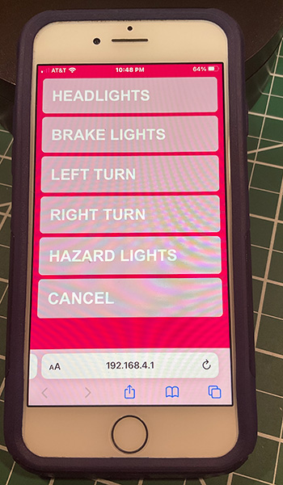

# RaspberryPiBeret

Using a Raspberry Pi PICO W, some NeoPixel LEDs, and MicroPython the make an IoT Safety Beret

[See it in action!](https://www.instagram.com/reel/ChtbwM4jqJA/?utm_source=ig_web_copy_link)

This code takes advantage of the dual M0+ cores of the Raspberry Pi RP2040 chipset and the multithreading libraries in Micropython.

## Hardware:
* [Raspberry Pi PICO W microcontroller](https://tnkr.in/5mm)
* [NeoPixel / WS2812b light Strips](https://tnkr.in/5mn)

## Thank yous:
* Alasdair Allan and his amazing Pico W [webserver tutorial](https://tnkr.in/5mo)
* Bob over at Bytes n' bits with his tutorial on [multithreading on PICO](https://tnkr.in/5mp)